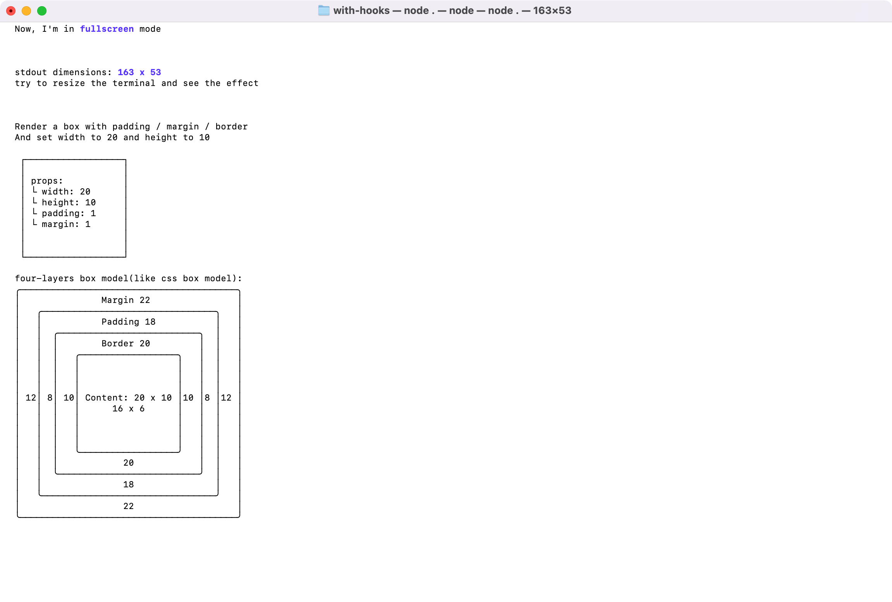

# ink-hooks

A collection of useful React hooks for building CLI applications with [Ink](https://github.com/vadimdemedes/ink).

## Features

- 🎯 **Type-safe** - Built with TypeScript
- 📦 **Tree-shakeable** - Only import what you need
- 🔄 **Reactive** - Automatically updates when terminal dimensions change
- 📐 **Box Model Support** - Calculate content, padding, border, and margin dimensions
- 🖥️ **Fullscreen Support** - Easy fullscreen mode management

## Screenshot



## Installation

```bash
npm install ink-hooks
# or
pnpm add ink-hooks
# or
yarn add ink-hooks
```

## Requirements

- React 19.2.0 or higher
- Ink 6.5.1 or higher

## Hooks

### `useStdoutDimensions`

Get the current terminal dimensions (columns and rows) and automatically update when the terminal is resized.

```tsx
import { useStdoutDimensions } from 'ink-hooks';

function App() {
  const { columns, rows } = useStdoutDimensions();
  
  return (
    <Text>
      Terminal size: {columns} x {rows}
    </Text>
  );
}
```

**Returns:**
- `columns: number` - Number of columns in the terminal
- `rows: number` - Number of rows in the terminal

### `useMeasure`

Measure the dimensions of a Box component.

```tsx
import { Box } from 'ink';
import { useMeasure } from 'ink-hooks';

function App() {
  const { ref, size } = useMeasure({
    borderStyle: 'single',
    padding: 1,
  });
  
  return (
    <Box ref={ref} borderStyle="single" padding={1}>
      <Text>Width: {size.width}, Height: {size.height}</Text>
    </Box>
  );
}
```

**Returns:**
- `ref: RefObject<DOMElement>` - Ref to attach to the Box component
- `size: { width: number, height: number }` - Measured dimensions

### `useBoxModel`

Calculate the box model dimensions (content, padding, border, margin) of a Box component.

```tsx
import { Box } from 'ink';
import { useBoxModel } from 'ink-hooks';

function App() {
  const { ref, content, padding, border, margin } = useBoxModel({
    borderStyle: 'single',
    padding: 1,
    margin: 1,
  });
  
  return (
    <>
      <Box ref={ref} borderStyle="single" padding={1} margin={1}>
        <Text>Content</Text>
      </Box>
      <Text>
        Content: {content.width}x{content.height} | 
        Border: {border.width}x{border.height} | 
        Margin: {margin.width}x{margin.height}
      </Text>
    </>
  );
}
```

**Returns:**
- `ref: RefObject<DOMElement>` - Ref to attach to the Box component
- `content: { width: number, height: number }` - Content box dimensions
- `padding: { width: number, height: number }` - Padding box dimensions
- `border: { width: number, height: number }` - Border box dimensions
- `margin: { width: number, height: number }` - Margin box dimensions

### `useFullScreen`

Enable fullscreen mode for the terminal. Automatically exits fullscreen when the component unmounts.

```tsx
import { useFullScreen } from 'ink-hooks';

function App() {
  const exitFullScreen = useFullScreen();
  
  // Component is now in fullscreen mode
  // Call exitFullScreen() manually if needed
  
  return <Text>Fullscreen mode active</Text>;
}
```

**Returns:**
- `exitFullScreen: () => void` - Function to manually exit fullscreen mode

## Examples

Check out the [examples directory](https://github.com/simonneo/inks/tree/main/examples) for more usage examples.

## License

MIT

